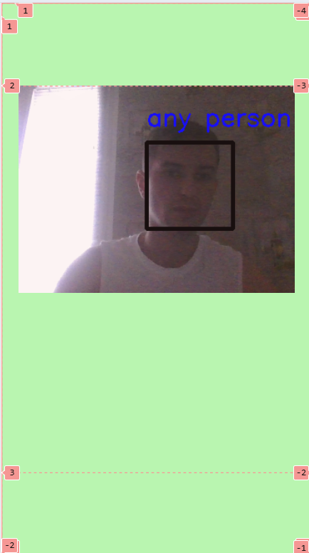

# Look for any person


### Запуск Development сервера

<p>Чтобы запустить сервер для разработки, выполните команду:</p>

```json
"start": "webpack serve --open"
```

### Создание билда для production

<p>Чтобы выполнить production сборку, выполните команду:</p>

```json
"build:prod": "webpack --env  mode=production"
```

### Создание билда для development

<p>Чтобы выполнить development сборку, выполните команду:</p>

```json
"build:dev": "webpack --env  mode=development",
```

### lint-staged




<!-- ### [Деплой приложения](https://gorgeous-salamander-2e3690.netlify.app/) -->
